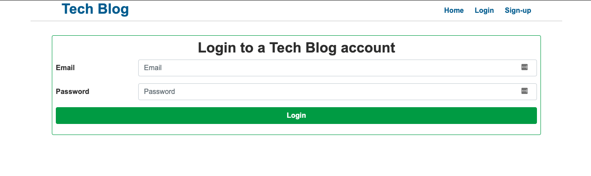
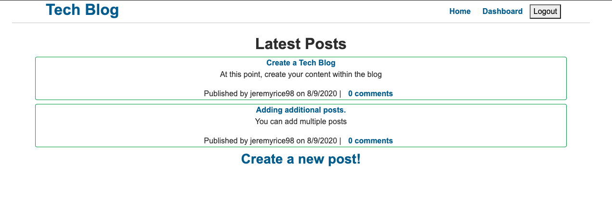
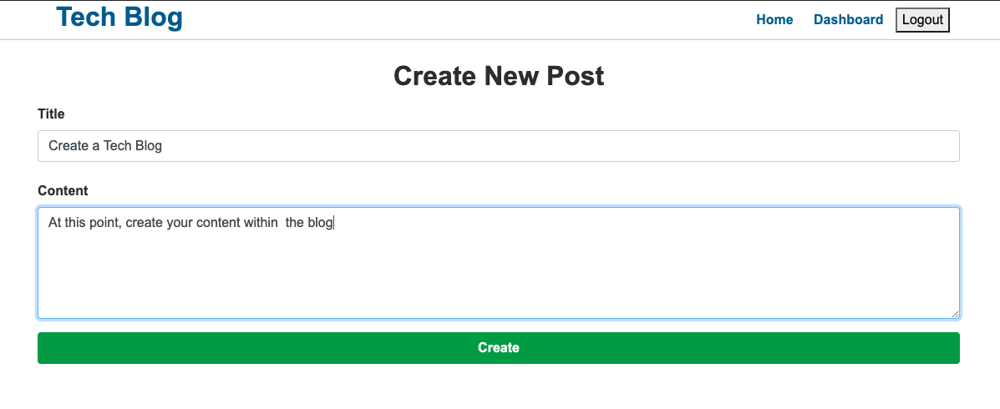
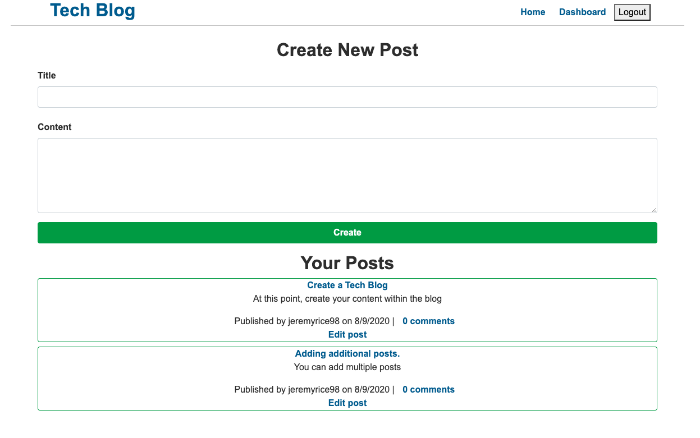

# 
**Tech Blog**
   
  
  
## **DESCRIPTION**   
> to build a CMS-style blog site similar to a Wordpress site, where developers can publish their blog posts and comment on other developers’ posts as well. You’ll build this site completely from scratch and deploy it to Heroku. Your app will follow the MVC paradigm in its architectural structure, using Handlebars.js as the templating language, Sequelize as the ORM, and the express-session npm package for authentication.  
  
## **TABLE OF CONTENTS**  
* [DESCRIPTION](#DESCRIPTION)  
* [TABLE OF CONTENTS](#TABLE-OF-CONTENTS)  
* [APPLICATION LINKS](#APPLICATION-LINKS) 
* [INSTALLATION](#INSTALLATION)  
* [USAGE](#USAGE)  
* [LICENSE](#LICENSE)  
* [CONTRIBUTING](#CONTRIBUTING)  
* [TESTS](#TESTS)  
* [QUESTIONS](#QUESTIONS)  
  
## **APPLICATION LINKS**   
> [Live Application](https://fast-refuge-72056.herokuapp.com/)  
> [GitHub Repository](https://github.com/jeremyrice98/tech-blog)  
  
## **INSTALLATION**   
There is no insatallation needed for this app.  Simply go to the website and utilize the application.  
  
## **USAGE**  
Go to the application link.  
  
## **LICENSE**  
> This application is covered under the MIT license.
  
## **CONTRIBUTING**  
> 1. [Node.js](https://nodejs.org/en/)
> 2. [Node Package Manager](https://www.npmjs.com/)
>     - [jest](https://www.npmjs.com/package/jest)
>     - [Express](https://www.npmjs.com/package/express)
>     - [connect-session-sequalize](https://www.npmjs.com/package/connect-session-sequelize)
>     - [MySQL2](https://www.npmjs.com/package/mysql2)
>     - [bcrypt](https://www.npmjs.com/package/bcrypt)
>     - [express-session](https://www.npmjs.com/package/express-session)
>     - [sequelize](https://www.npmjs.com/package/sequelize)
>     - [mysql2](https://www.npmjs.com/package/mysql2)
> 3. [Javascript](https://developer.mozilla.org/en-US/docs/Web/JavaScript)
> 4. [jQuery](https://jquery.com/)
> 5. [JSON](https://www.json.org/json-en.html)
> 6. [Insomnia](https://support.insomnia.rest/article/11-getting-started)
> 7. [Heroku](https://dashboard.heroku.com/apps)
  
## **TESTS**  
> Insomnia was used to test GET and POST Routes.     

##  **FUNCTIONALITY**

1. In a browser, navigate to the [application](https://fast-refuge-72056.herokuapp.com/)

2. You will need to create and account prior to having the ability to post.  

3. Once logged in, you will see a list of previous posts that you can review and contribute to. 

4. After your account has been created, click on "create a post" to begin your post.

5. If you click on "Dashboard" in the upper right hand corner, this will take you to your own homepage where you can create additional posts and see any other posts you've created.

  
## **QUESTIONS**  
Please contact me for any inquiries!  
| Reach Out | Repositories | Profile |  
| :------: | :------: |  :------: |  
| <ricefamily1003@gmail.com> | [GitHub](https://github.com/jeremyrice98?tab=repositories) |  [LinkedIn](https://www.linkedin.com/in/jeremy-rice-99055113/) |   